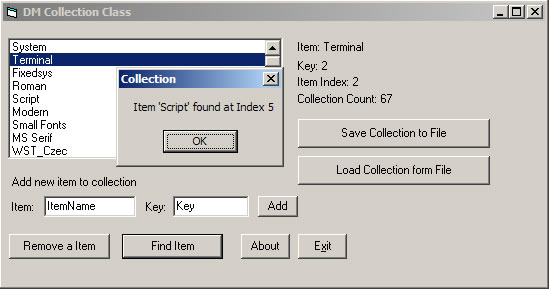



## DM Collection Class

### Description

Hi this is a custom collection class I made some time back and forgot to submit it so here it is. anyway You can add new items, Keys, Find Items, Find Keys, Remove Items from a collection, Load and Save Collections to a File and more. Example included. If I have time I will try and inprove on it if you like it.
 
### More Info
 

             |
---                |---
**Submitted On**   |2005-07-28 21:40:16
**By**             |[dreamvb](https://github.com/Planet-Source-Code/PSCIndex/blob/master/ByAuthor/dreamvb.md)
**Level**          |Beginner
**User Rating**    |4.7 (28 globes from 6 users)
**Compatibility**  |VB 6\.0
**Category**       |[Object Oriented Programming \(OOP\)](https://github.com/Planet-Source-Code/PSCIndex/blob/master/ByCategory/object-oriented-programming-oop__1-47.md)
**World**          |[Visual Basic](https://github.com/Planet-Source-Code/PSCIndex/blob/master/ByWorld/visual-basic.md)
**Archive File**   |[DM\_Collect1918537292005\.zip](https://github.com/Planet-Source-Code/dreamvb-dm-collection-class__1-61953/archive/master.zip)

